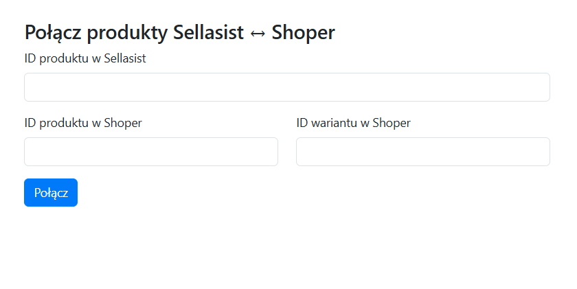
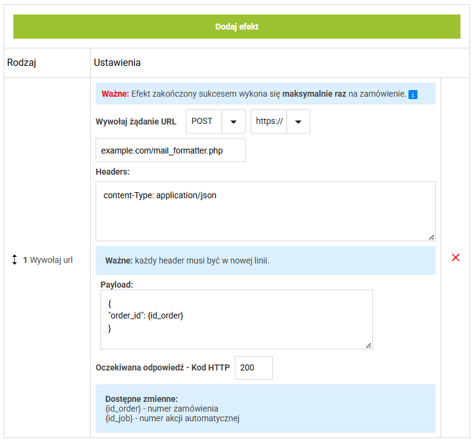

# Skrypty pomocnicze dla rozszerzenia Chrome Sellasistant

### Instalacja
1. Wrzuć skrypty na serwer do jednego katalogu
2. Dostosuj zmienne w pliku config.php
3. W ustawieniach Sellasistanta podaj adresy skryptów

## Skrypty:

### mapper.php
Pozwola mapować produkty z Shopera na produkty w Sellasist. Może być używany niezależnie od Sellasistanta - poprostu skieruj przeglądarkę na adres skryptu.

### postal.php
Odpytuje API, pobiera nazwę miejscowości po kodzie pocztowym i wstawia w pole na Miejscowość na stronie zamówienia

### mail_shortener.php
Skraca adres Allegro z abc+xyz@allegromail.pl do abc@allegromail.pl aby umożliwić wyszukiwanie zamówień w Responso.
W Sellasist należy ustawić akcję automatyczną "WYWOŁAJ URL":

### sa_connector.php
Komunikujacja z API Sellasista